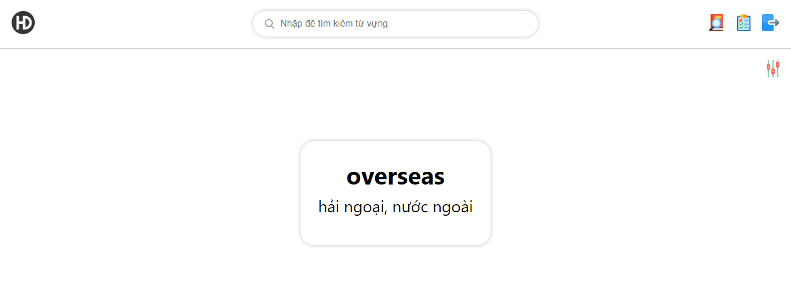
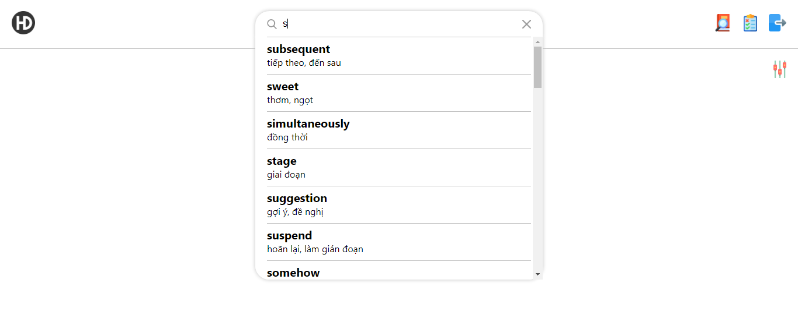
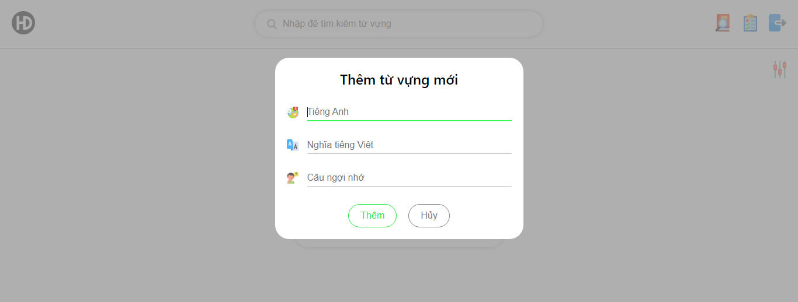
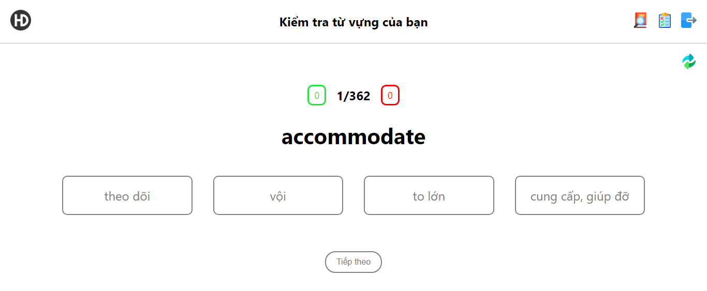

# Mô tả
Trang web giúp lưu trữ, tìm kiếm và kiểm tra từ vựng đã học

# Một vài hình ảnh giao diện
## Giao diện đăng nhập

## Giao diện trang chủ

## Giao diện tìm kiếm từ vựng

## Giao diện thêm từ vựng

## Giao diện kiểm tra từ vựng
